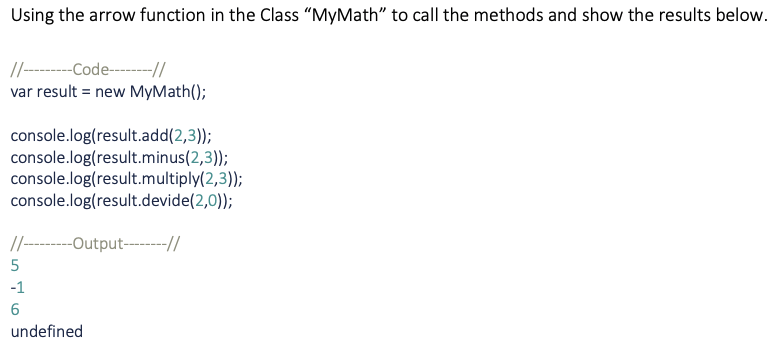

# Inclass10: ES6 (Arrow Function)

## Due February 7, 2022 11:59 PM -- Closes February 7, 2022 11:59 PM

### **Instructions**

Please follow the practice in the attached file. To submit the file:

- Please copy your code to the txt file
- Name your file as math_student_id.txt ==> math_6123456.txt

Reference materials

