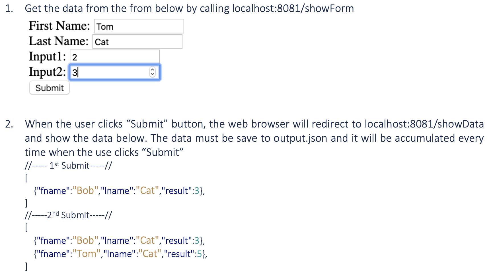

# Inclass12: Express with HTML Form In-Class
## Due tomorrow at 11:59 PMCloses February 21, 2022 9:00 AM
### **Instructions**
Follow the instruction in the attached file. 
result = input1+input2
- For your submission, Please submit your app.js file but rename the file to be app_studentid.txt ----> app_6123456.txt
- Your html file must be renamed to showForm_studentid.html --> showForm_6123456.html

